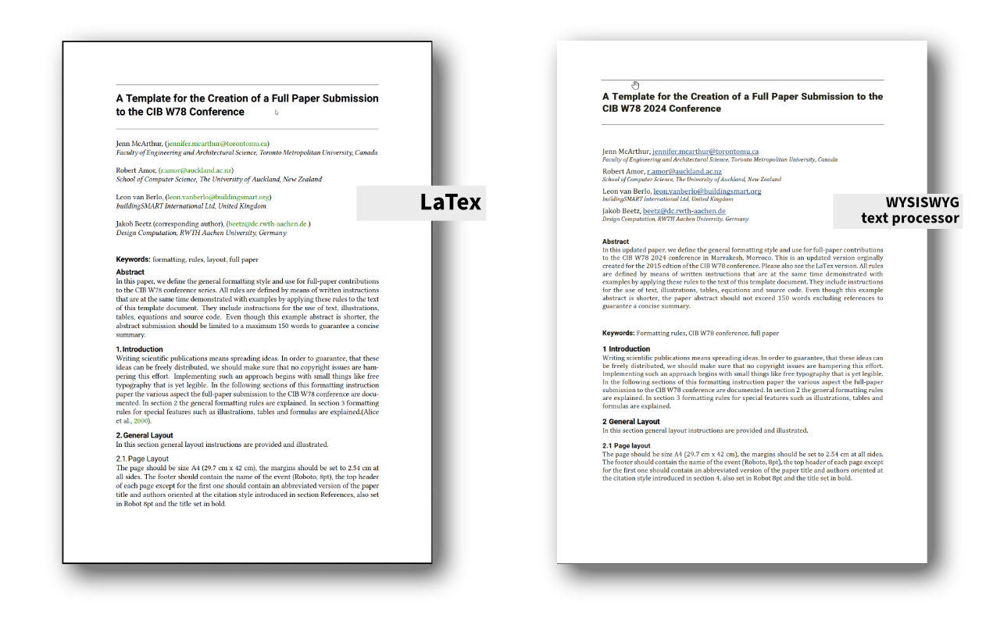

# Paper Templates for the CIB W78 Conference series

Please use these templates for [CIB W78](https://www.cibw78.org/) and its [2024 edtion in Marrakesh, Morroco](https://cibw78-conference.org/)

Along with rendered PDF examples.

There are two main branches of the full paper templates:
## LaTex template (preferred)
- Created for the 2024 edition, 
- tested on Overleaf to guarantee interoperbility with major collaboration tools
- based on a `\documentclass[a4paper, 12pt]{article}` class
- for `pdfLaTex` with a `biblatex` for the bibliography

## Word processor template
- for popular text processors
- .odt and .docx

## Contributing
LaTex is a seven-headed hydra, and I have nothing but a humble pitchfork. If you spot issues, have comments etc. please use the discussion section or create an issue. PRs welcome.  

## License
Do whatever seems usefull to you CC BY
